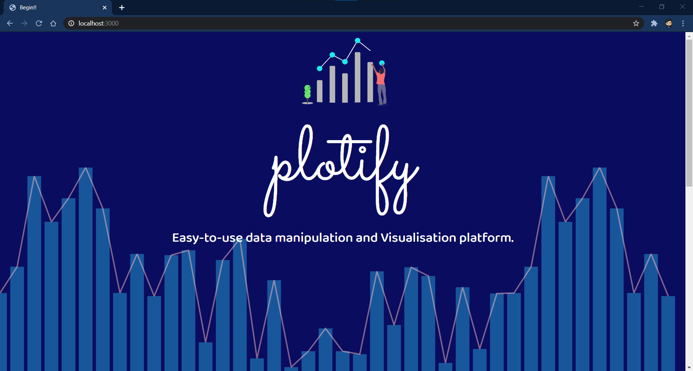
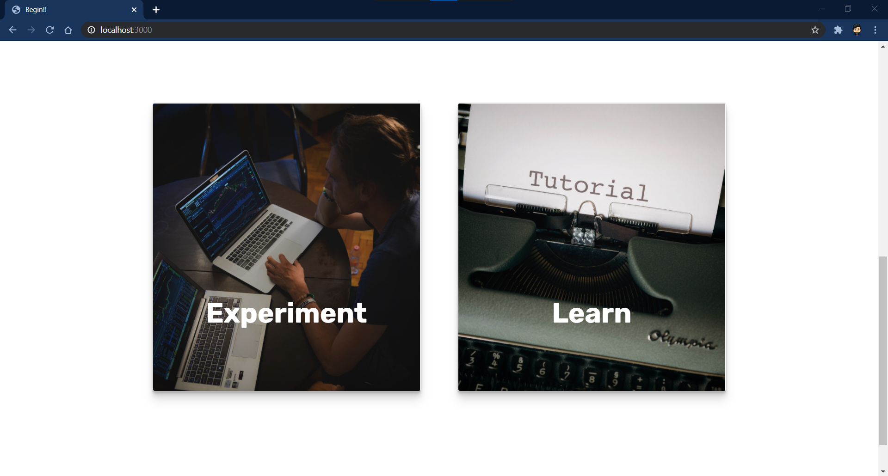
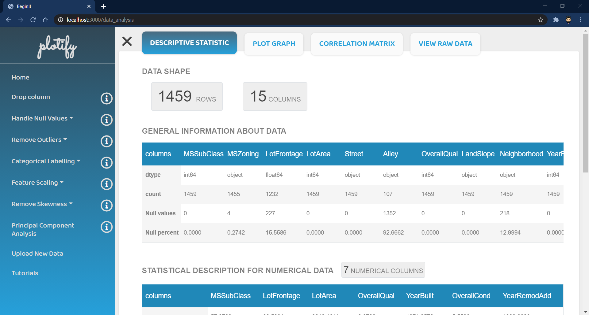
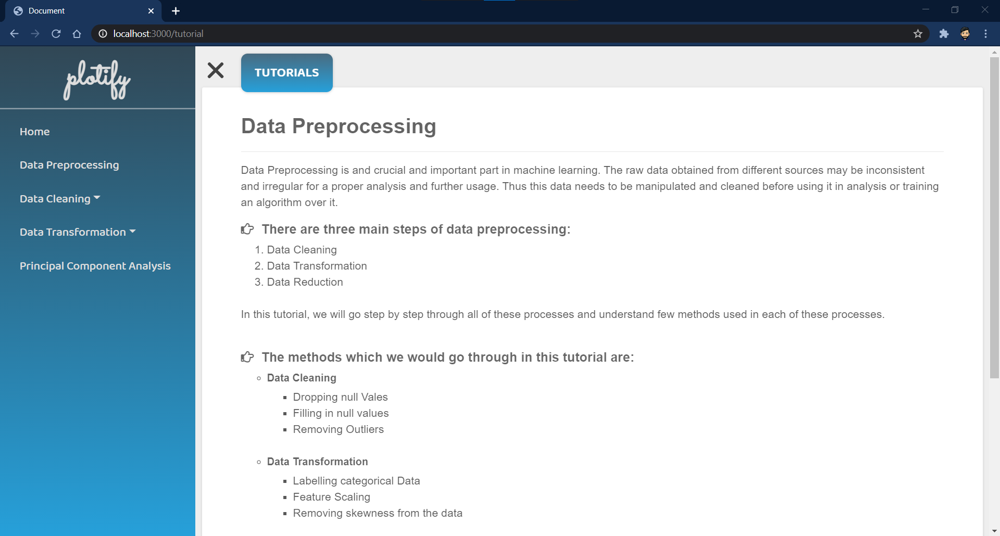

# RunTime-Terror : PLOTIFY 


##### Easy-to-use data manipulation and Visualisation platform.


## Table of Contents

1. [Introduction](#Introduction)
2. [Purpose](#Introduction)
3. [Features](#Features)
4. [Tools-Used](#Tools-Used)
5. [Prerequisites](#Prerequirites)
6. [Installation](#Installation)
7. [Demonstration](#Demonstration)
8. [Contributors](#Contributions)

## Introduction

**Plotify**, as the name suggests, will let you to play with your data. It is a web app that helps to analyze data and perform different statistical methods without having to write code. It is deliberately developed for machine learning and data science enthusiats. You can upload your data, play with it using some of the methods, and thereafter download the results. Yes, you heard that right; it is that simple, and there is no need to worry about typing code and fixing it. And don't worry if you're a beginner who's not confident what to do with data and whatnot; we've got you covered with step-by-step tutorials, and you can even try your hands on data while learning.

## Purpose

_*Want to train your machine learning model quickly but are constrained by data preprocessing ?*_
_*Do you find data preprocessing and visualizing time-consuming?*_

To provide a solution, we have created a website where you can perform all of the steps of data preprocessing and data analysis without writing code. Using this app will also save you time as you do not have to worry about writing code or plotting graphs. Even if you get stuck and don't know what to do next, we provide you tutorials, recommendations, and some tips.

## Features

- **_Analyze Data_** - A descriptive statistics tab displays all the basic information about your data where, Numerical and Categorical data columns are analyzed separately.

- **_Visualise Data_** - Visualize a particular feature using Univariate plots( Histogram, Box Plot, Scatter Plot, Line Plot) and Multivariate plots(Correlation Matrix)

- **_Data Cleaning_** - Handle Null values and Remove outliers using various methods available.

- **_Data Transformation_** - Transform Categorical Data, Normalise and Standardise Data, as well remove skewness using various methods available.  
- **_Data Reduction_** - Perform Feature Reduction using Principal Component Analysis.
- **_Tips_** - Tips are provided for each method to assist you in obtaining better result.
- **_Recommendations_** - To make your task easier, suggestions for which method to use for each column are provided.
- **_Revert_** - You can revert back last 3 changes made to data.
- **_Tutorials_** - Tutorials to walk you through all of the steps of Data Preprocessing. 

## Prerequisites

1. Node (npm)
2. Python
3. Python Libraries - Pandas, NumPy, scikit-learn, SciPy, seaborn,json, sys, csv, math, os, category_encoders

## Installation

To get a copy of the website running on your local system follow these steps :

1.  First clone the Repository.

    ```git clone https://github.com/RuntimeTerror-Plotify/plotify.git```

2.  Move to the directory and install all the dependencies.

    ```npm install```

3.  To run the website on localhost.

    ```node index.js```

## Demonstration

**Have a look at the** <a href="https://google.com/">Video Demonstration</a>. 

- Landing Page



- Dashboard


- Tutorials


## Tools-Used

- <a href="https://nodejs.org/">Node</a> - Node.js is an open-source, cross-platform, JavaScript runtime environment that executes JavaScript code outside of a browser.
- <a href="https://jquery.com/">JavaScript (JQuery)</a> - jQuery is a fast, small, and feature-rich JavaScript library.
- <a href="https://www.python.org/">Python</a> - Python is a programming language that lets you work more quickly and integrate your systems more effectively.
- <a href="https://expressjs.com/">Express</a> - Express is a minimal and flexible Node.js web application framework that provides a robust set of features for web and mobile applications.
- <a href="https://plotly.com/">Plotly</a> - Plotly is an open-source graphing library
- <a href="https://getbootstrap.com/">Bootstrap</a> - Bootstrap, the world’s most popular front-end open source toolkit

### Contributors
<table>
    <tr>
        <td align="center"><a href="https://github.com/shrushti22"><br /><sub><b>Shrushti Vasaniya</b></sub></a><br /></td>
        <td align="center"><a href="https://github.com/RutvijDv"><br /><sub><b>Rutvij Vamja</b></sub></a><br /></td>
        <td align="center"><a href="https://github.com/vrutikrabadia"><br /><sub><b>Vrutik Rabadia</b></sub></a><br /></td>
    </tr>
</table>    
